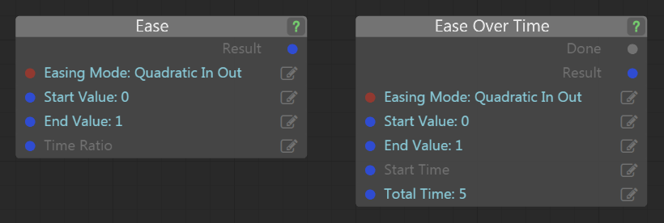

stingray-easing
===============

A plug-in for Stingray that adds easing math functions to Lua, Flow and C.

You can use these easing functions to smoothly interpolate numeric values along a curve between a start and end value, like one of these:


(source: [http://easings.net/](http://easings.net/))

These easing curves are particularly useful for moving a camera smoothly between two viewpoints without jarring starts and stops, but you can use them for any kind of parametric animation you need in your project.

## Install

1.	Download the latest release from the [Releases](/bbor/stingray-easing/releases) tab of this repo, and extract it to disk.

	Or, get a clone of this repo and run `make.rb` to build its binaries from scratch.

2.	Open the Stingray Editor, and go to the **Plugin Manager** (Alt+Shift+P).

3.	Click **Add Plugin**, browse to the folder you extracted (or the `plugin` folder of this repo if you built it yourself), and select the `easing.stingray_plugin` file.

4.	This plug-in adds a resource folder that contains its custom Flow node definitions. If you want to use these Flow nodes in your project, you'll have to add this resource folder to your `boot.package` file (or to another package that you load in later). Add the following line to the bottom of the file:

	`flow_node_definitions = ["easing-resources/*"]`

## Use in Lua

This plug-in adds the following functions to the Lua environment:

`stingray.Easing.ease_ratio( mode, time_ratio ) : number`

-	`mode` is the easing mode (see below.)
-	`time_ratio` is the delta-time value, expressed as a number between 0 and 1. This is basically the X axis of the curve images above, where 0 is all the way to the left and 1 is all the way to the right.
-	The return value is the result of the interpolation for the selected curve, expressed as a number between 0 and 1. Basically the Y axis of the curves above. You can apply this ratio yourself to whatever data you're animating.

This is the handiest function if you're manipulating the time value you pass in to a linear interpolation function on a vector, matrix or quaternion (see below).

`stingray.Easing.ease_values( mode, start_value, end_value, time_ratio ) : number`

-	`mode` is the easing mode (see below.)
-	`start_value` is the numeric start value for the interpolation.
-	`end_value` is the numeric end value for the interpolation.
-	`time_ratio` is the delta-time value, expressed as a number between 0 and 1. This is basically the X axis of the curve images above, where 0 is all the way to the left (and will result in returning the `start_value`) and 1 is all the way to the right (and will result in returning the `end_value`).
-	The return value is the interpolation for the selected curve between the `start_value` and the `end_value`. Basically the Y axis of the curves above.

`stingray.Easing.ease_values_over_time( mode, start_value, end_value, total_time, elapsed_time ) : number`

-	`mode` is the easing mode (see below.)
-	`start_value` is the numeric start value for the interpolation.
-	`end_value` is the numeric end value for the interpolation.
-	`total_time` is the total amount of time that the animation should take to move from the start value to the end value.
-	`elapsed_time` is the delta-time value, expressed as a number between 0 and `total_time`. This is basically the X axis of the curve images above, where 0 is all the way to the left (and will result in returning the `start_value`) and `total_time` is all the way to the right (and will result in returning the `end_value`).
-	The return value is the interpolation for the selected curve between the `start_value` and the `end_value`. Basically the Y axis of the curves above.

**Mode names**

The `mode` parameter can be any of the following constants:

-	`stingray.EasingMode.LINEAR`
-	`stingray.EasingMode.QUADRATIC_IN`
-	`stingray.EasingMode.QUADRATIC_OUT`
-	`stingray.EasingMode.QUADRATIC_IN_OUT`
-	`stingray.EasingMode.CUBIC_IN`
-	`stingray.EasingMode.CUBIC_OUT`
-	`stingray.EasingMode.CUBIC_IN_OUT`
-	`stingray.EasingMode.QUARTIC_IN`
-	`stingray.EasingMode.QUARTIC_OUT`
-	`stingray.EasingMode.QUARTIC_IN_OUT`
-	`stingray.EasingMode.QUINTIC_IN`
-	`stingray.EasingMode.QUINTIC_OUT`
-	`stingray.EasingMode.QUINTIC_IN_OUT`
-	`stingray.EasingMode.SINE_IN`
-	`stingray.EasingMode.SINE_OUT`
-	`stingray.EasingMode.SINE_IN_OUT`
-	`stingray.EasingMode.CIRCULAR_IN`
-	`stingray.EasingMode.CIRCULAR_OUT`
-	`stingray.EasingMode.CIRCULAR_IN_OUT`
-	`stingray.EasingMode.EXPONENTIAL_IN`
-	`stingray.EasingMode.EXPONENTIAL_OUT`
-	`stingray.EasingMode.EXPONENTIAL_IN_OUT`
-	`stingray.EasingMode.ELASTIC_IN`
-	`stingray.EasingMode.ELASTIC_OUT`
-	`stingray.EasingMode.ELASTIC_IN_OUT`
-	`stingray.EasingMode.BACK_IN`
-	`stingray.EasingMode.BACK_OUT`
-	`stingray.EasingMode.BACK_IN_OUT`
-	`stingray.EasingMode.BOUNCE_IN`
-	`stingray.EasingMode.BOUNCE_OUT`
-	`stingray.EasingMode.BOUNCE_IN_OUT`

For example:

```lua
local interpolated_value = stingray.Easing.ease_values( stingray.EasingMode.QUADRATIC_IN_OUT, 10, 20, 0.25 )
print(tostring(interpolated_value))  -- 11.25
```

## Use in Flow

The easing functions are exposed to Flow through two nodes: **Math > Ease** and **Math > Ease Over Time**.



-	Choose the easing function you want to use from the **Easing Mode** list.
-	The **Start Value** and **End Value** are optional; you can leave them at 0 and 1.
-	Use the node on the left if you want to provide the delta-time value for the calculation, expressed as a number between 0 and 1. This is basically the X axis of the curve images above, where 0 is all the way to the left (and will result in returning the `start_value`) and 1 is all the way to the right (and will result in returning the `end_value`).
-	As an alternative, so that you don't have to calculate the ratio yourself, you can use the node on the right to pass in a start time and the total time that you want the transformation to take (in seconds). The node will calculate the delta-time (i.e. the location on the X axis of the curve images above) based on these values.
-	The **Result** is the interpolation between the start value and the end value at the specified delta time along the curve you've chosen. Basically the Y axis of the curves above.
-	The **Ease Over Time** node emits the Done event when the total time has elapsed since the start time.

## Use in C from another engine plug-in

If you're writing your own plug-in in C, you can call these easing functions through this plug-in's API. Retrieve its API from the engine by calling the `PluginManagerApi::next_plugin_api()` function, passing the `EASING_API_ID` below. Cast the pointer returned by the engine into this struct definition:

```c
unsigned EASING_API_ID = 0x1ed2147a;
struct easing_api {
	enum EASING_MODE {
		EASING_MODE_LINEAR,
		EASING_MODE_QUADRATIC_IN,
		EASING_MODE_QUADRATIC_OUT,
		EASING_MODE_QUADRATIC_IN_OUT,
		EASING_MODE_CUBIC_IN,
		EASING_MODE_CUBIC_OUT,
		EASING_MODE_CUBIC_IN_OUT,
		EASING_MODE_QUARTIC_IN,
		EASING_MODE_QUARTIC_OUT,
		EASING_MODE_QUARTIC_IN_OUT,
		EASING_MODE_QUINTIC_IN,
		EASING_MODE_QUINTIC_OUT,
		EASING_MODE_QUINTIC_IN_OUT,
		EASING_MODE_SINE_IN,
		EASING_MODE_SINE_OUT,
		EASING_MODE_SINE_IN_OUT,
		EASING_MODE_CIRCULAR_IN,
		EASING_MODE_CIRCULAR_OUT,
		EASING_MODE_CIRCULAR_IN_OUT,
		EASING_MODE_EXPONENTIAL_IN,
		EASING_MODE_EXPONENTIAL_OUT,
		EASING_MODE_EXPONENTIAL_IN_OUT,
		EASING_MODE_ELASTIC_IN,
		EASING_MODE_ELASTIC_OUT,
		EASING_MODE_ELASTIC_IN_OUT,
		EASING_MODE_BACK_IN,
		EASING_MODE_BACK_OUT,
		EASING_MODE_BACK_IN_OUT,
		EASING_MODE_BOUNCE_IN,
		EASING_MODE_BOUNCE_OUT,
		EASING_MODE_BOUNCE_IN_OUT,
	};

	float(*ease_ratio)(EASING_MODE mode, float time_ratio);
	float(*ease_values)(EASING_MODE mode, float start_value, float end_value, float time_ratio);
	float(*ease_values_over_time)(EASING_MODE mode, float start_value, float end_value, float total_time, float elapsed_time);
};
```

## But I want easings for vectors too! And quaternions! Matrices, yo!

No sweat!

1.	Stingray already has *linear* interpolation (lerp) functions for interpolating vertices, quaternions and matrices. These are available in Lua (e.g. `stingray.Vector3.lerp()`), Flow (e.g. the **Vector3 > Lerp** node), and C++ (e.g. `stingray_plugin_foundation::lerp()`). Get started by setting up one of these guys to interpolate your data linearly between your start and end points over time.

2.	Use the stuff in this plug-in to get an easing ratio for delta-time value you're passing in to the linear interpolate function, using a start value of 0 and an end value of 1. This gives you the interpolation ratio for whichever curve you've chosen at that moment in time.

3.	Take that ratio, multiply it by your *original* delta-time value, and pass the result of that multiplication in to the lerp function as the delta-time.

Voilá! You've effectively added easing to the linear interpolation by controlling the rate at which the *time* advances for the calculation.

You can also take advantage of this effect to tweak your easing results in other ways -- if you can't quite get the effect you're looking for, you can always run a ratio result back through another pass of the same easing function or a different function, or average the results of two different functions... Try it out to come up with some interesting combinations!

## Compatibility

Requires Stingray 1.8 or later.

## Attribution

The implementations used in this plug-in come from:

<https://github.com/warrenm/AHEasing>
